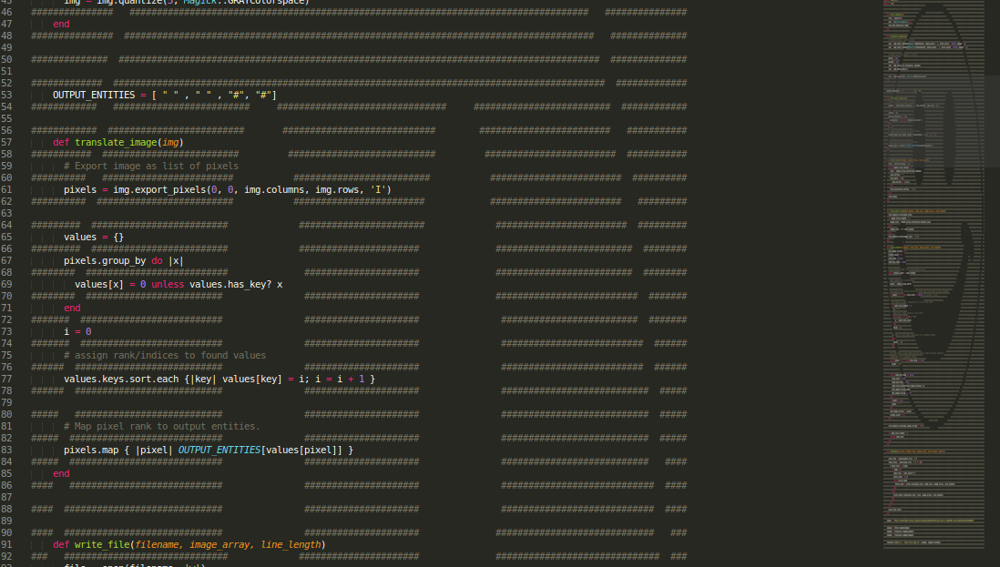

# ascii_art_coder

t

TODO
1. Enable command line arguments
2. Enable option to switch between interleave and inline
 - Interleave: every other line is the image (#write_other_line method)
 - Inline: the image is formed using the code (#write_line method

